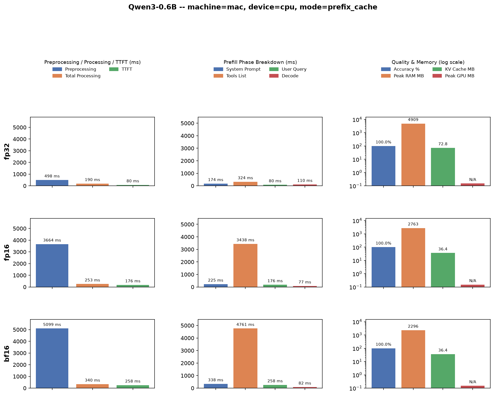
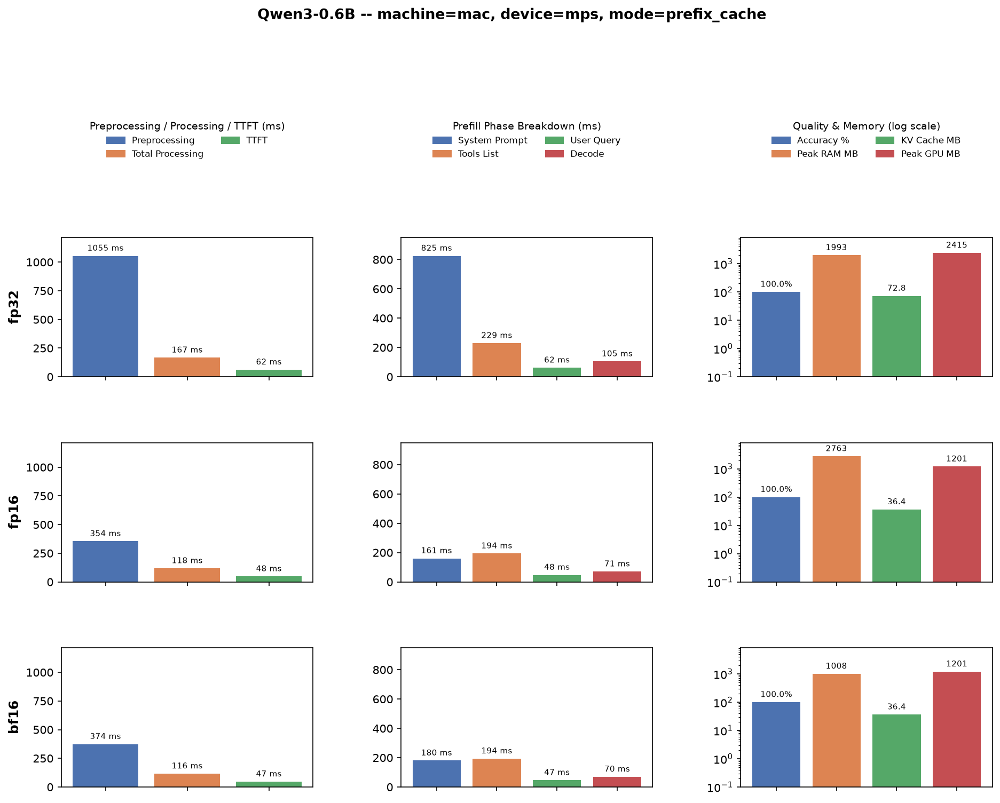
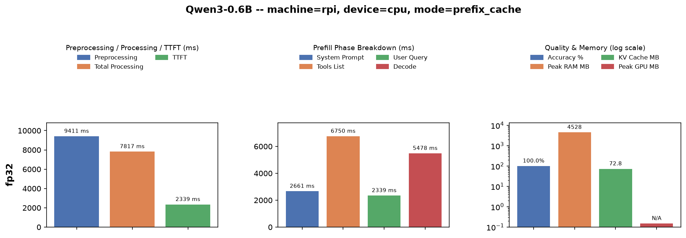
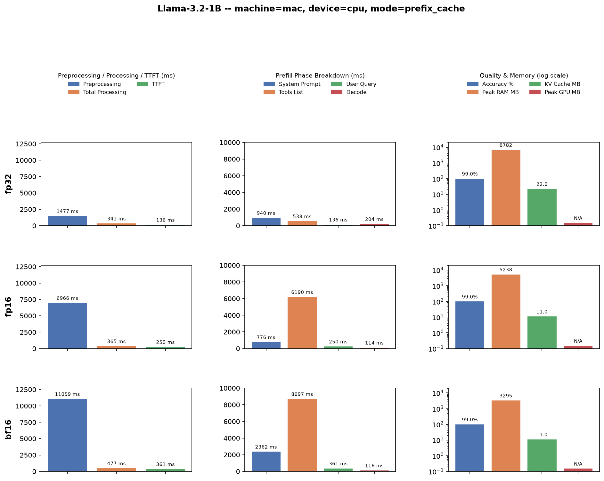
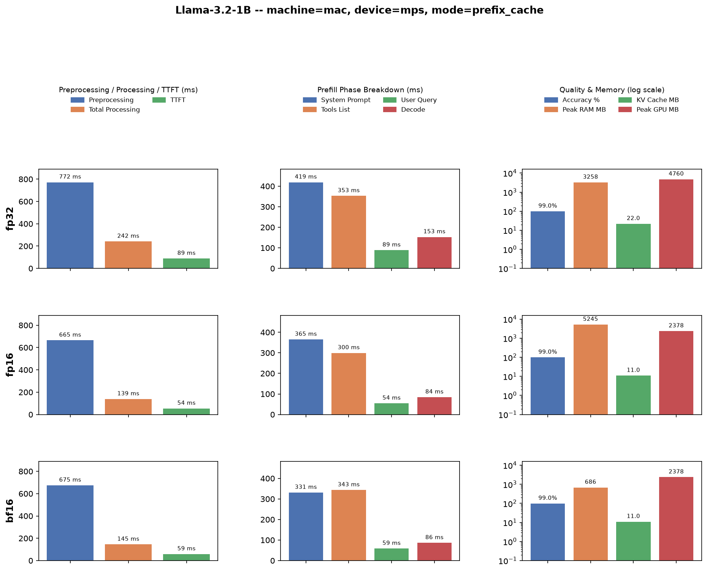
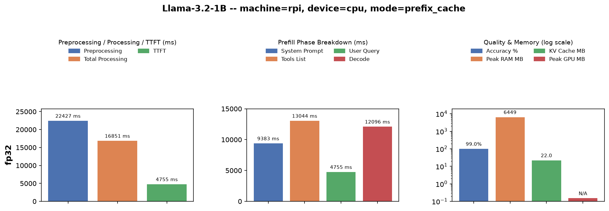

# Baseline Evaluation — Final Report

## Benchmarks

- HF Transformers baseline (`prefix_cache` mode)
- 98 measured examples from `dataset_full/sample_0001.json`
- Models: **Qwen3-0.6B** and **Llama-3.2-1B**
- Precisions: **fp32 / fp16 / bf16**
- Devices: **Mac CPU**, **Mac MPS**, **RPi CPU** (fp32 only — fp16/bf16 skipped, too slow to be practical).

---

## Charts

Each chart

- rows = available precisions (fp32/fp16/bf16, RPi has fp32 only)
- columns = Preprocessing/Total-Processing/TTFT, Prefill-phase breakdown, Quality & memory.
- Y-axis is shared per column across rows so bar heights are directly comparable.

### Qwen3-0.6B — Mac CPU

### Qwen3-0.6B — Mac MPS

---

### Qwen3-0.6B — RPi CPU

---

### Llama-3.2-1B — Mac CPU

### Llama-3.2-1B — Mac MPS

---

### Llama-3.2-1B — RPi CPU

---

## Observations

1. **fp16 is consistently the slowest precision on CPU**, not the fastest, despite using half the bits of fp32.
   - On Mac CPU, fp16 preprocessing is ~10-11x slower than fp32 (Qwen3: 324ms → 3438ms; Llama3: 538ms → 6190ms).
   - bf16 is slower still (~15-16x vs fp32).
   - Root cause: PyTorch's CPU backend has no optimized fp16 GEMM kernel path (unlike CUDA tensor cores); fp32 routes through fast oneDNN/MKL-DNN kernels that fp16/bf16 don't use on CPU in this setup.
2. **MPS is dramatically faster than CPU for both models**, as expected for a GPU-backed path.
   - Qwen3 fp32 e2e: 190ms (CPU) vs 167ms (MPS).
   - Llama3 fp32 e2e: 341ms (CPU) vs 242ms (MPS).
   - The gap is much larger for fp16/bf16 specifically, since MPS *does* have fast fp16/bf16 kernels (Qwen3 bf16 e2e: 340ms CPU vs 116ms MPS — a ~3x speedup).
3. **RPi is 40-50x slower than Mac CPU** at the same fp32 precision.
   - Qwen3 e2e: 190ms (Mac) vs 7817ms (RPi).
   - Llama3 e2e: 341ms (Mac) vs 16851ms (RPi).
   - Consistent with the much weaker CPU and lower memory bandwidth of the Pi.
   - This confirms fp32 (not fp16, which would be even worse per Observation 1) is the right baseline precision for RPi deployment testing.
4. **Accuracy is unaffected by precision.**
   - Qwen3 holds 100% tool-selection accuracy across every dtype/device combination.
   - Llama3 holds 98.98% tool-selection accuracy across every dtype/device combination.
   - Precision choice here is purely a latency/memory tradeoff, not a quality one.
5. **Memory scales as expected with dtype.**
   - fp32 KV-cache and peak-GPU-memory are consistently ~2x the fp16/bf16 values.
   - e.g. Llama3 KV cache: 22.5MB (fp32) vs 11.25MB (fp16/bf16).
   - e.g. Qwen3 MPS peak GPU: 2415MB (fp32) vs 1201MB (fp16/bf16).
   - Matches the halved per-element byte width.
6. **Preprocessing (system prompt + tools list) dominates total latency** in every configuration.
   - It's ingested from scratch per example in these runs.
   - It is 5-20x larger than the live per-request TTFT.
   - Reinforces the earlier finding that caching/amortizing the tools-list ingestion (not just the system prompt) is the highest-leverage optimization for real deployment.
7. **On MPS, peak RAM (CPU-side) is highest for fp16 — even higher than fp32 — while bf16 stays lowest.** This looks counter-intuitive (fp16 has the smallest final weight size) but is a loading-time artifact, not a steady-state one.
   - Both checkpoints are natively stored as **bf16** (`config.json` → `"dtype": "bfloat16"`).
   - `--dtype bfloat16`: no conversion needed, weights load as-is.
   - `--dtype float32`: bf16→fp32 is a cheap bit-widening (bf16 is a truncated fp32), so only one buffer swap.
   - `--dtype float16`: bf16 and fp16 have incompatible bit layouts, so PyTorch must numerically requantize via bf16 → fp32 (intermediate) → fp16, briefly holding **all three buffers** in memory at once.
   - `peak_ram_mb` is measured via `ru_maxrss`, a high-water mark that never decreases — so this transient 3-buffer loading spike gets permanently recorded, even though it's freed moments later.
   - Confirmed by `peak_gpu_mb` (MPS device memory, a live post-generate snapshot, not a high-water mark): fp16 and bf16 are identical there, since the actual steady-state model+KV-cache footprint is the same 2-byte-per-element size for both — only the one-time load spike differs.

---

## Conclusions

- **Use fp32 (or bf16 on MPS) — avoid fp16 on CPU entirely.**
  - It is strictly worse than fp32 for CPU inference in this stack with no accuracy benefit.
- **MPS is the clear winner on Mac.**
  - Best for both latency and, with fp16/bf16, memory footprint.
  - Prefer it over CPU whenever available.
- **RPi is viable only with fp32** among the tested precisions.
  - Even then it is ~40-50x slower than a Mac.
  - For latency-sensitive on-device deployment, further optimization (quantization via ONNX Runtime/llama.cpp, or offloading) is needed rather than relying on this HF Transformers baseline.
- **Next optimization target should be the tools-list preprocessing phase.**
  - It is the single largest latency contributor across all configurations.
  - It is a natural candidate for caching in production (tools lists are largely static per deployment).
